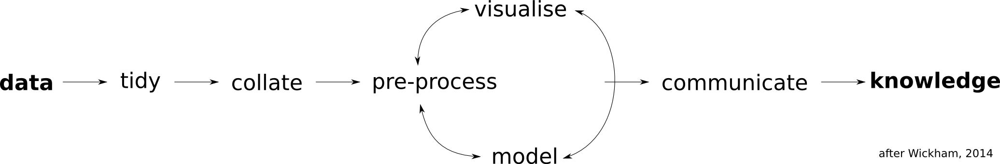
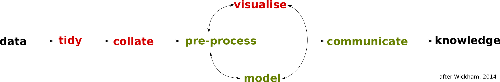
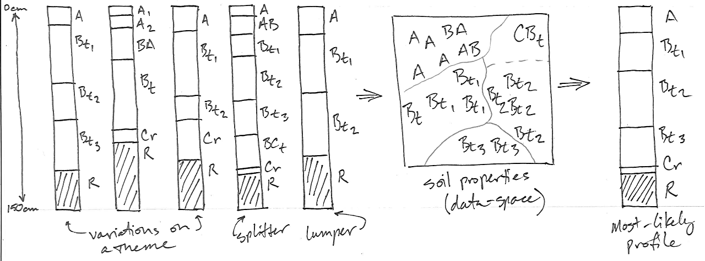
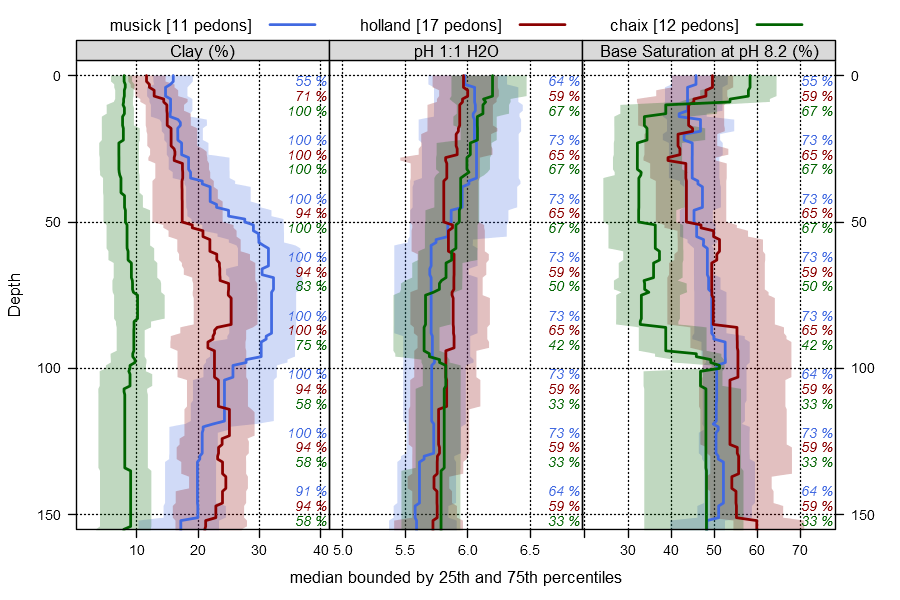
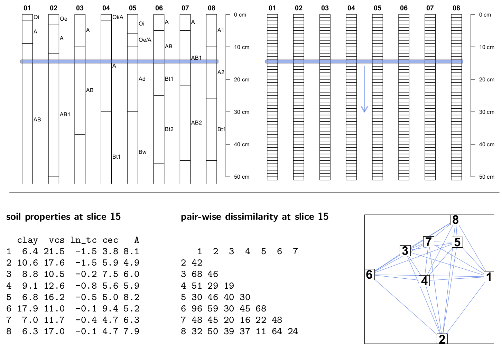
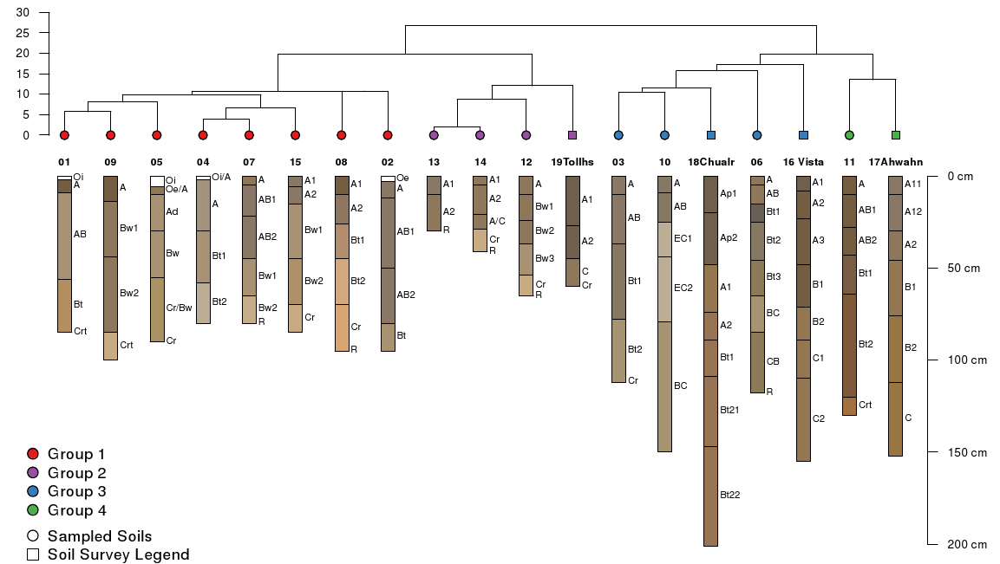
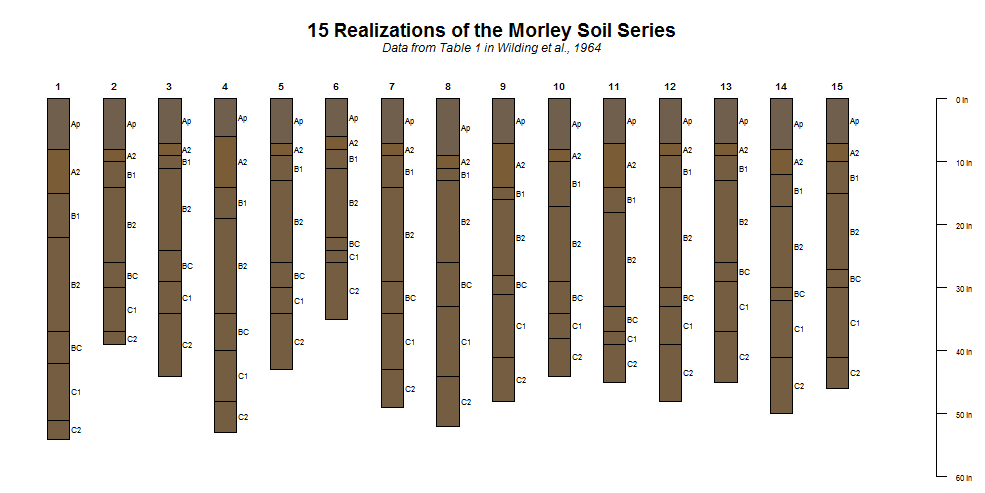

Algorithms for Quantitative Pedology: a toolkit for digital soil morphometrics
========================================================
transition: none
width: 1024
height: 800
css: custom.css

D.E. Beaudette, P. Roudier, J.M. Skovlin


<br><br><br><br><br><br><br><br>
<span style="color: white; font-size:50%;">This document is based on `aqp` version 1.8-8 </span>


Outline
========================================================
class: smaller

## Main Ideas

1. framework and vocabulary for soil data modeling
2. specialized data structures to accommodate **most** soil information (soilDB companion package)
3. data vizualization via. sketches
4. re-sampling via slicing / slabbing and related vizualization
5. numerical classification
6. extensible (examples in companion sharpshootR package)

## Digital Soil Morphometrics Examples

1. ML profile generation
2. profile-level aggregate / stock estimation
3. continuous-representation of data collected from genetic horizons (e.g. depth-function estimation)
4. TODO: coalate recent work and find some more!
5. Pierre: any recent work examples?
6. scavenge from AQP website

Soil data analysis is changing
===============================

- volume
- variety
- velocity (rate of change)

Emerging needs
=======================

- reproducibility
- automation
- scalability
- handling of complex data
- communication/outreach

Why R?
========================================================
 
- repeatable, self-documenting work:
 - 2800+ packages on CRAN: 100+ packages on GIS, ecology, and **soils**!
 - package system: algorithms + docs + sample data
 
- advanced data visualisation capabilities

- algorithm development by experts, application by trained users
 - testing by eye: simple graphical "grammar" used to plot data
 - formalized testing: correlation, regression, classification, ordination, ...
 - I/O capabilities: file, URL, SOAP, SQL, ODBC, PDF, PNG, SHP, KML, ...
 - optimizers, matrix operations, custom data structures, ...


Soil data analysis in practice
===================================


It's a long road....
===================================



Improving the workflow
===================================




aqp package: Algorithms for Quantitative Pedology
========================================================
class: smaller

<span class="oneliner">a "vocabulary" for soil data analysis</span>



- special data structures: avoids annoying book-keeping code
- visualization: soil profile sketches
- aggregation: depth-slice summaries
- classification: pair-wise dissimilarity of profiles
- ...
- ...


SoilProfileCollection Objects
========================================================
<span class="oneliner">custom datatype to store/access hierarchy of soil profile information</span>


```
Formal class 'SoilProfileCollection' [package "aqp"] with 7 slots
  ..@ idcol     : chr "peiid"
  ..@ depthcols : chr [1:2] "hzdept" "hzdepb"
  ..@ metadata  :'data.frame':	1 obs. of  1 variable:
  ..@ horizons  :'data.frame':	308 obs. of  34 variables:
  ..@ site      :'data.frame':	54 obs. of  59 variables:
  ..@ sp        :Formal class 'SpatialPoints' [package "sp"] with 3 slots
  ..@ diagnostic:'data.frame':	177 obs. of  4 variables:
```


SoilProfileCollection Objects
========================================================

Typical pedon/site data:
```
id, top, bottom, name, group
1,  0,   10,     A,    g1
1,  10,  18,     AB,   g1
          ...
2,  12,   22,    E,    g2
2,  22,   45,    Bhs1, g2
```

Converting `data.frame` &#8594; `SoilProfileCollection`:

```r
x <- read.csv(file = ...)
# promote to SoilProfileCollection
depths(x) <- id ~ top + bottom
# move 'site data' into @site
site(x) <- ~group
```

Functions that return `SoilProfileCollection`:

```r
x <- fetchOSD()
x <- fetchKSSL()
x <- fetchPedonPC()
x <- fetchNASIS()
x <- fetchNASIS_component_data()
```

<span class="link-to-details">&#8594;&nbsp;[SoilProfileCollection tutorial](https://r-forge.r-project.org/scm/viewvc.php/*checkout*/docs/aqp/aqp-intro.html?root=aqp)</span>


SoilProfileCollection Objects
========================================================
class: small-code

- <span style="font-size: 80%;">object inspection</span>

```r
idname(sp4) # pedon ID name
horizonDepths(sp4) # colum names containing top and bottom depths
depth_units(sp4) # defaults to 'cm'
metadata(sp4) # data.frame with 1 row
profile_id(sp4) # vector of profile IDs
```

- <span style="font-size: 80%;">overloads to common functions</span>

```r
length(sp4) # number of profiles in the collection
nrow(sp4) # number of horizons in the collection
names(sp4) # column names from site and horizon data
min(sp4) # shallowest profile depth in collection
max(sp4) # deepest profile depth in collection
sp4[i, j] # get profile "i", horizon "j"
```

- <span style="font-size: 80%;">getting / setting of components</span>

```r
horizons(sp4) # get / set horizon data
site(sp4)  # get / set site data
diagnostic_hz(sp4) # get / set diagnostic horizons
proj4string(sp4) # get / set CRS
coordinates(sp4) # get / set coordinates
```

- <span style="font-size: 80%;">coercion to `SpatialPointsDataFrame` or `data.frame`</span>

```r
as(sp4, 'SpatialPointsDataFrame')
as(sp4, 'data.frame')
```


Plotting SoilProfileCollection Objects
========================================================
<span class="oneliner">flexible generation of soil profile sketches using "base graphics"</span>


<span class="link-to-details">&#8594;&nbsp;[plotSPC() manual page](http://aqp.r-forge.r-project.org/aqp-html-manual/SPC-plotting.html)</span>


Slice-Wise Aggregation
========================================================
<span class="oneliner">aggregation along regular "depth-slices" and within groups</span>



<span class="link-to-details">&#8594;&nbsp;[slab() manual page](http://aqp.r-forge.r-project.org/aqp-html-manual/SPC-slab-methods.html)</span>


Pair-Wise Dissimilarity
========================================================



Pair-Wise Dissimilarity
========================================================



OK, So What?
========================================================
class: small-code
<span class="oneliner">how about some examples</span>

- simulating data to feed / test models

```r
sim(SPC, n=10, hz.sd=2)
random_profile(id, n=c(3, 4, 5), min_thick=5, max_thick=30, n_prop=5)
```
- profile sketches ordered by meaningful gradient

```r
plot(SPC, plot.order=new.order)
```
- applying functions by profile

```r
profileApply(SPC, <function>)
```
- "slicing": depth-wise alignment and extraction of data

```r
slice(SPC, 0:50 ~ sand + silt + clay)
```
- aggregating by "slab": group / depth-wise summaries

```r
# assuming no NA
slab(SPC, ~ sand + silt + clay, slab.fun=mean)
slab(SPC, ~ sand + silt + clay, slab.structure=c(0,10), slab.fun=mean)
slab(SPC, group ~ sand + silt + clay, slab.fun=mean)
```


Simulated Data: Horizon Depths and Designations
========================================================
class: small-code


```r
# source data are a single profile description of the Morley series as a data.frame
depths(b) <- id ~ top + bottom
# convert horizon colors into RGB
b$soil_color <- munsell2rgb(b$hue, b$value, b$chroma)
# simulate 15 profiles based on reported horizon thickness standard deviations
b.sim <- sim(b, n=15, hz.sd=c(2,1,1,2,4,2,2,4))
# set depth units to inches
depth_units(b.sim) <- 'in'
```



<span class="link-to-details">&#8594;&nbsp;[sim() manual page](http://aqp.r-forge.r-project.org/aqp-html-manual/sim.html)</span>


Simulated Data: Physical Properties
========================================================
class: small-code
<span class="oneliner">simulation based on a [random walk](http://en.wikipedia.org/wiki/Random_walk)-- similar to highly stratified soils</span>


```r
# implicit loop via plyr::ldply, result is a data.frame
d <- ldply(1:10, random_profile, n=c(6, 7, 8), n_prop=1, method='random_walk')
# promote to SoilProfileCollection and plot
depths(d) <- id ~ top + bottom
par(mar=c(0,0,3,0))
plot(d, color='p1', axis.line.offset=-4, max.depth=150)
```


<span class="link-to-details">&#8594;&nbsp;[random_profile() manual page](http://aqp.r-forge.r-project.org/aqp-html-manual/random_profile.html)</span>


Simulated Data: Physical Properties
========================================================
class: small-code
<span class="oneliner">simulation based on the [logistic power peak](http://www.sciencedirect.com/science/article/pii/S0016706111002163) function-- more realistic anisotropy</span>


```r
# implicit loop via plyr::ldply, result is a data.frame
d <- ldply(1:10, random_profile, n=c(6, 7, 8), n_prop=1, method='LPP', 
lpp.a=5, lpp.b=10, lpp.d=5, lpp.e=5, lpp.u=25)
# promote to SoilProfileCollection and plot
depths(d) <- id ~ top + bottom
par(mar=c(0,0,3,0))
plot(d, color='p1', axis.line.offset=-4, max.depth=150)
```


<span class="link-to-details">&#8594;&nbsp;[random_profile() manual page](http://aqp.r-forge.r-project.org/aqp-html-manual/random_profile.html)</span>


Magnesic Soils of California
========================================================
class: small-code
<span class="oneliner">data From [McGahan et al.](https://www.soils.org/publications/sssaj/abstracts/73/6/2087)</span>


```r
# load sample dataset, comes with aqp package
data(sp4)
# inspect first 4 rows x 12 columns
sp4[1:4, 1:12]
```

```
      id name top bottom   K   Mg  Ca CEC_7 ex_Ca_to_Mg sand silt clay
1 colusa    A   0      3 0.3 25.7 9.0  23.0        0.35   46   33   21
2 colusa  ABt   3      8 0.2 23.7 5.6  21.4        0.23   42   31   27
3 colusa  Bt1   8     30 0.1 23.2 1.9  23.7        0.08   40   28   32
4 colusa  Bt2  30     42 0.1 44.3 0.3  43.0        0.01   27   18   55
```

```r
# upgrade to SoilProfileCollection
depths(sp4) <- id ~ top + bottom

# custom function for computing hz-thick wt. mean, accounting for missing data
wt.mean.ca.mg <- function(i) {
    # use horizon thickness as a weight
    thick <- i$bottom - i$top
    # function is from the Hmisc package
    m <- wtd.mean(i$ex_Ca_to_Mg, weights=thick, na.rm=TRUE)
    return(m)
    }

# apply custom function to each profile, save as "site-level" attribute
sp4$wt.mean.ca.to.mg <- profileApply(sp4, wt.mean.ca.mg)

# generate index ordering from small -> large Ca:Mg
new.order <- order(sp4$wt.mean.ca.to.mg)
```

<span class="link-to-details">&#8594;&nbsp;[profileApply() manual page](http://aqp.r-forge.r-project.org/aqp-html-manual/profileApply-methods.html)</span>


Magnesic Soils of California
========================================================
class: small-code


```r
# plot the data using our new order based on Ca:Mg
par(mar=c(4,0,3,0))
plot(sp4, name='name', color='ex_Ca_to_Mg', plot.order=new.order, cex.name=0.75, id.style='side', axis.line.offset=-4,)

# add an axis labeled with the sorting criteria
axis(1, at=1:length(sp4), labels=round(sp4$wt.mean.ca.to.mg, 3), cex.axis=1)
mtext(1, line=2.25, text='Horizon Thickness Weighted Mean Ex. Ca:Mg', cex=1)
```


<span class="link-to-details">&#8594;&nbsp;[sp4 sample data set](http://aqp.r-forge.r-project.org/aqp-html-manual/sp4.html)</span>


Summarize Clay vs Depth by Geology
========================================================
class: small-code


```r
pedons <- fetchNASIS()
# ... details on generalization of geologic classes ommitted ...
# aggregate by major geologic type, default slab.fun = hdquantile
a <- slab(pedons, generalized_bedrock ~ clay)

# plot with lattice graphics
xyplot(top ~ p.q50 | generalized_bedrock, upper=a$p.q75, lower=a$p.q25, data=a, ylim=c(180,-5), ylab='Depth (cm)', xlab='Clay Content (%)', strip=strip.custom(bg=grey(0.85)), as.table=TRUE, panel=panel.depth_function, prepanel=prepanel.depth_function, scales=list(y=list(tick.number=7, alternating=3), x=list(alternating=1)), subset=variable == 'clay', layout=c(6,1), cf=a$contributing_fraction, sync.colors=TRUE, alpha=0.25)
```


<span class="link-to-details">&#8594;&nbsp;[slab() manual page](http://aqp.r-forge.r-project.org/aqp-html-manual/SPC-slab-methods.html)</span>


Wrap-Up
========================================================

- **getting soils data** can be difficult and time-consuming
- DSM requires considerable **data processing**
- DSM requires detailed **analysis** of soil profile collections or aggregate soils data

AQP can help:
- "fetch" your data from NASIS, KSSL, SDA, SCAN, SoilWeb, etc.
- [SoilProfileCollection](https://r-forge.r-project.org/scm/viewvc.php/*checkout*/docs/aqp/aqp-intro.html?root=aqp) objects are powerful
- innovative constructs: `slice()`, `slab()`, `SPC[i,j]`
- pair-wise dissimilarity: `profile_compare()`
- visual comparisons and non-parametric summaries

&#8594;&nbsp; ideas and code welcome, plenty of room for improvement

<br>
Join the fun at the [AQP r-forge site](http://r-forge.r-project.org/projects/aqp/)


