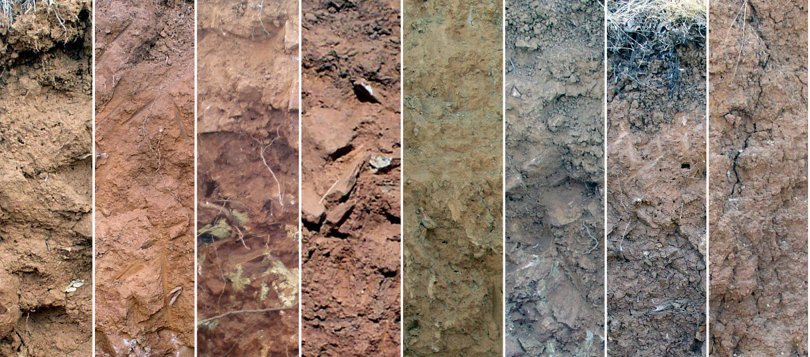

```{r setup, echo=FALSE, results='hide'}
# options for knitr
library(knitr, quietly = TRUE)
opts_chunk$set(message=FALSE, warning=FALSE, background='#F7F7F7', dpi=100, fig.align='center', dev='png', dev.args=list(pointsize=10, type='cairo', antialias='subpixel'), tidy=TRUE)

# options for R session
options(width=100, stringsAsFactors=FALSE)
```


```{r load-data-most-analysis, echo=FALSE, message=FALSE}
# libraries
library(aqp)
library(latticeExtra)
library(rms)
library(plyr)
library(reshape)
library(scales)
library(cluster)
library(knitr)
library(ggplot2)
library(e1071)

# load sample data
data(loafercreek, package = 'soilDB')

# discreet colors used to plot horizon probability depth-functions
cols <- c('black', grey(0.33), 'goldenrod4', 'orange', 'orangered', 'chocolate', 'green', 'blue')

# graphical range in horizon mid-point, sorted by class-wise median depth
loafercreek$mid <- with(horizons(loafercreek), (hzdept + hzdepb) / 2)
hz.designation.by.median.depths <- names(sort(tapply(loafercreek$mid, loafercreek$hzname, median)))

# generalize horizon names using REGEX rules
n <- c('Oi', 'A', 'BA','Bt1','Bt2','Bt3','Cr','R')
p <- c('O', '^A$|Ad|Ap|AB','BA$|Bw', 'Bt1$|^B$','^Bt$|^Bt2$','^Bt3|^Bt4|CBt$|BCt$|2Bt|2CB$|^C$','Cr','R')
loafercreek$genhz <- generalize.hz(loafercreek$hzname, n, p)

# remove non-matching generalized horizon names
loafercreek$genhz[loafercreek$genhz == 'not-used'] <- NA
loafercreek$genhz <- factor(loafercreek$genhz)

# keep track of generalized horizon names for later
hz.names <- levels(loafercreek$genhz)

# associate GHL colors
loafercreek$genhz.soil_color <- cols[match(loafercreek$genhz, hz.names)]
```
```{r pro-slice, echo=FALSE, cache=TRUE}
# slice out color and horzizon name into 1cm intervals: no aggregation
max.depth <- 150
slice.resolution <- 1
slice.vect <- seq(from = 0, to = max.depth, by = slice.resolution)
s <- slice(loafercreek, slice.vect ~ genhz.soil_color + genhz)

# convert horizon name to factor
s$genhz <- factor(s$genhz, levels = hz.names)

# compute slice-wise probability: slice-wise P always sum to 1
a <- slab(loafercreek, ~ genhz, cpm=1)

# convert to long-format for plotting
a.long <- melt(a, id.vars='top', measure.vars=hz.names)
```

```{r pro-po-model, echo=FALSE, cache=TRUE, results='hide'}
# proportional-odds logistics regression: fits well, ignore standard errors
# using sliced data properly weights observations... but creates optimistic SE
# rcs required when we include depths > 100 cm...
# should we use penalized PO-LR? see pentrace()

# work with a non-NA subset of the sliced data
# this way we can splice-in residuals, etc.
idx <- which(complete.cases(horizons(s)[, c('genhz', 'hzdept')]))
s.sub <- horizons(s)[idx, ]

## TODO: how many knots and where should we put them?
## 4 knots seems about right, by default they are spaced along quantiles of hzdept
## linear -> rcs with 4 knots: R2 0.888 -> 0.893
dd <- datadist(s.sub) ; options(datadist="dd")
l.genhz <- orm(genhz ~ rcs(hzdept, parms=c(knots=4)), data=s.sub, x=TRUE, y=TRUE)

# predict along same depths: columns are the class-wise probability
# fitted.ind --> return all probability estimates
p <- data.frame(predict(l.genhz, data.frame(hzdept=slice.vect), type='fitted.ind'))

# re-name, rms model output give funky names
names(p) <- hz.names

# add depths
p$top <- slice.vect

# melt to long format for plotting
p.long <- melt(p, id.vars='top', measure.vars=hz.names)

# combine sliced data / predictions
g <- make.groups(sliced.mode.1 = a.long, PO.model = p.long)
g$which <- factor(g$which, labels=c('empirical probabilities', 'PO-logistic regression'))

# remove P(hz) < 1%
g$value[which(g$value < 0.01)] <- NA

# re-shape to wide format, for comparison of fitted vs. empirical probabilities
g.wide <- cast(g, top + variable ~ which, value.var = 'value')
names(g.wide) <- make.names(names(g.wide))

# extract ML-horizon boundaries 
a.ml <- get.ml.hz(a, hz.names)
p.ml <- get.ml.hz(p, hz.names)

# generate ordering vector of loafrcreek based on GHL similarity
a.slab.id <- slab(loafercreek, peiid ~ genhz, cpm=1)
depths(a.slab.id) <- peiid ~ top + bottom
d <- profile_compare(a.slab.id, vars=hz.names, max_d=140, k=0)
h <- diana(d)

# Shannon's H index for po-lr model, computed by depth-slice
# using a log base of length(hz.names) constrains the value to 0--1
shannon.h <- apply(p[, hz.names], 1, function(i) -sum(i*log(i, base = length(hz.names))))

# use NA-free values/predictions for Brier Score calc
p.s  <- data.frame(predict(l.genhz, s.sub, type='fitted.ind'))

# re-name, rms model output give funky names
names(p.s) <- hz.names

# combine NA-free, original data + predictions
p.s <- cbind(s.sub, p.s)

# eval Brier Score by gen hz
# note that predictions at any given depth slice will always be the same
p.bs <- ddply(p.s, 'genhz', function(x.i) {
  # save the gen hz probabilities into new df
  x.pr <- x.i[, hz.names]
  # init new matrix to store most-likely gen hz class
  m <- matrix(0, ncol=ncol(x.pr), nrow=nrow(x.pr))
  # same structure as x.pr
  dimnames(m)[[2]] <- names(x.pr)
  # set appropriate genhz to 1
  for(i in 1:nrow(x.i)) {
    ml.hz.i <- x.i$genhz[i]
    m[i, ml.hz.i] <- 1
    }
  # compute bs for this gen hz
  bs <- sum((x.pr - m)^2, na.rm=TRUE) / nrow(x.pr)
  })

# fix names
names(p.bs) <- c('genhz', 'brier.score')

# remove NAs from table
p.bs <- na.omit(p.bs)

## mix GHL colors using weights derrived from predicted probabilities
# convert color vector RGB -> HSV space
cols.rgb <- col2rgb(cols)
cols.hsv <- rgb2hsv(cols.rgb)
  
# make room for mixed color, one for each slice
p.s$mixed.color <- NA

# along each slice, mix colors and save back to DF
for(i in seq_along(p.s$hzdept)) {
  # get the probabilities for this slice, use as weights
  p.i <- unlist(p.s[i, hz.names])
  # weights * color vector in HSV-space
  hsv.i <- sweep(cols.hsv, 2, p.i, '*')
  # compute weighted-mean for this slice
  wt.mean.hsv <- rowSums(hsv.i) / sum(p.i)
  # convert color coords -> color for plotting
  p.s$mixed.color[i] <- do.call('hsv', as.list(wt.mean.hsv))
}
```

```{r pro-model-robustness, echo=FALSE, cache=TRUE}
# encapsulate model fitting / prediction within a single function
f.test <- function(s, idx.in, slice.vect, hz.names) {
  
  # split into calibration / validation sets
  s.cal <- s[idx.in, ]
  s.val <- s[setdiff(1:length(s), idx.in), ]
  
  # fit model to a subset of the original data
	l.genhz <- try(orm(genhz ~ rcs(hzdept, parms=c(knots=4)), data=horizons(s.cal)))
	
	# sometimes the subset doesn't permit model fitting, in that case return NULL
	if(inherits(l.genhz, 'try-error'))
		return(list(predictions=NULL, model.disc.index=NULL))
	
	# otherwise generate predictions
	p <- data.frame(predict(l.genhz, data.frame(hzdept=slice.vect), type='fitted.ind'))
	names(p) <- hz.names
	p$top <- slice.vect
	
	p.long <- melt(p, id.vars='top', measure.vars=hz.names)
	mdi <- l.genhz$stats['R2']
	
  # compare most-likely GHL by slice and compare with original assignments
  p.val <- data.frame(predict(l.genhz, horizons(s.val), type='fitted.ind'))
  p.val$hz <- hz.names[apply(p.val, 1, which.max)]
  p.val$hz <- factor(p.val$hz, levels=hz.names)
  
  # compute class agreement
  cross.tab <- table(original=s.val$genhz, predictions=p.val$hz)
  agreement <- classAgreement(cross.tab, match.names = TRUE)
  
	return(list(predictions=p.long, model.disc.index=mdi, cross.tab=cross.tab, agreement=agreement))
}

# init an empty list
n.reps <- 250
l.res <- list()

## TODO: it would be nice to evaluate the model at each iteration using
##       those observations that were left out
# loop a bunch of times, re-fitting the model to a subset of only 25 profiles
for(i in 1:n.reps) {
	len.vect <- 1:length(loafercreek)
	idx.in <- sample(len.vect, size=25, replace=FALSE)
	# s.left.out.idx <- setdiff(len.vect, s.idx)
	l.res[[paste('rep.', i, sep='')]] <- f.test(s, idx.in, slice.vect, hz.names)
}

# convert the result from a list into a data.frame, and remove very small probs.
d.res <- ldply(l.res, function(i) i$prediction)
d.res$value[which(d.res$value < 0.01)] <- NA

# extract model discrimination index
res.mdi <- unlist(sapply(l.res, function(i) i$model.disc.index))

# compute mean cross-tab
r <- Reduce('+', lapply(l.res, function(i) i$cross.tab))
mean.cross.tab <- round(r / n.reps)

## how useful is this?
# get distribution of Kappa
res.kappa <- unlist(sapply(l.res, function(i) i$agreement$kappa))
```

```{r pro-eval-genz, echo=FALSE, results='hide', cache=TRUE}
# compute horizon mid-points
loafercreek$mid <- with(horizons(loafercreek), (hzdept + hzdepb) / 2)
# store the column names of our variables of interest
vars <- c('clay', 'mid', 'total_frags_pct', 'm_value')
# result is a list of several items
hz.eval <- evalGenHZ(loafercreek, 'genhz', vars)
```

# Abstract

Published soil survey reports typically describe soils in terms of aggregate information: soil properties, interpretations, and limitations that are based on a collection of field-described soil profiles. 
While aggregate soil properties are readily estimated via standard statistical functions (mean, median, etc.), an aggregate representation of horizonation (e.g. genetic or functional horizon designation and depth) is typically difficult to construct. 
Variation in horizon designation among different soil scientists and different soil description systems, changes in horizon designation standards over time, variable depths at which horizons occur, and the various uncertainties associated with these are all factors that complicate the process of delivering an aggregate representation of horizonation. 
In this paper we propose alternatives to the typical "representative profile" -- e.g. the selection of a single soil profile to represent a collection. Two possible methods for aggregating a collection of soil profiles into synthetic profiles are presented, describing depth-wise probability functions for each horizon. 
Both methods rely on an expert-guided description of generalized horizon designation (e.g. a subset of horizon designation labels that convey a reasonable "morphologic story") along with associated rules (regular expression patterns) used to correlate field-described to generalized horizon designation. 
The first method is based on (1-cm interval) slice-wise evaluation of generalized horizon designation; the second is based on a proportional-odds logistic regression model fit to depth-slices. 
These methods are demonstrated using USDA-NRCS soil survey data (USA). 


# Introduction

Published soil survey reports typically describe soils in terms of *aggregate* information, *ie* soil properties, interpretations, and limitations that are based on a collection of field-described soil profiles. 
While aggregate soil properties are readily estimated via standard statistical functions (mean, median, etc.), an aggregate representation of *horizonation* (e.g. genetic horizon designation and depth) is typically difficult to construct [@beaudette2013]. 
Variation in horizon designation "style" among different soil scientists, changes in horizon designation standards over time, variable depths at which genetic horizons occur, and the possible lack of a specific genetic horizon are all factors that complicate the process of delivering an aggregate representation of horizonation. The process of designating horizons by soil scientists can be somewhat subjective; even a second description of the same volume of soil can lead to a slightly different set of horizon designations and depths [@Holmgren1988]. In addition to human sources of variability, it is understood that most of the variation between profile descriptions is due to real differences between soils observed at different locations [@Wilding1964].

The "modal pedon" concept ... not ideal, but widely used:

* problems with the modal concept [@Hudson1990]

* discrete representation of soils (via soil profile) despite continuous gradation [@Jones1959]


This complex combination of variability in morphologic horizon designation and depths is rarely acknowledged at the series or component level: boundaries between horizons, expressed as horizon depths, are generally considered as "crisp" numbers, while in actuality they represent "fuzzy" numbers due to the varying distinctness of the horizon boundaries and how abruptly characteristics change at horizon boundaries.

Soil profiles and their corresponding soil horizons represent a record of soil formation and encapsulate significant information about soil morphology. 
Although new tools and technologies may make continuous-depth measurements of soils possible, horizon designations, have historically been the common pedological language used to annotate observations of changes in soil properties with depth [@Hartemink2014;@myers2011;@Kempen2011]. 


In order to aggregate properties for soil horizons within a collection of soil profiles, horizons must be systematically correlated into groups of similar soil morphology. The aggregtation of horizons then becomes a conceptual profile that is synthesized to represent the central concept of the soil morphology conveyed by the entire suite of soil profiles. 
The use of generalized horizon labels (GHL) provides a framework for correlating individual soil horizons, however, traditional aggregates only provide a coarse summary of corresponding horizon depths derived for the aggregated conceptual profile. This paper presents a novel approach using a depth-slicing method in the aqp package to determine horizon depth probabilities.

Possible mention of logistic regression in context of this paper:
* ordinal response models in ecology [@Antoine2000]

* horizon thickness [@Vanwalleghem2010]

* "red clay" hz presence, logistic regression [@Evans2014296]

We demonstrate two possible methods for aggregating a collection of soil profiles into "synthetic profiles"; describing depth-wise probability functions for each genetic horizon. 
Both methods rely on an expert-guided description of generalized horizon designation (e.g. horizon designations that are deemed representative) along with associated rules (regular expression patterns) used to correlate field-described to generalized horizon designation. 
The first method is based on (1-cm interval) slice-wise evaluation of generalized horizon designation; the second is based on a proportional-odds logistic regression [@McCullagh1980] model fit to depth-slices. Specialized classes for soil profile collections and depth-slicing algorithms are implemented in the [aqp](http://cran.at.r-project.org/web/packages/aqp/index.html) package for R [@beaudette2013].


# Materials and Methods

## Soil Profile Data

A collection of (`r length(loafercreek)`) soil profiles from the Sierra Foothill Region of California were used to demonstrate two approaches for determining aggregate representation of genetic horizon boundaries. This collection of soil profile data represents the work of 13 different soil scientists, with described properties spanning ranges in physical properties (mostly related to bedrock composition) and are included within the **soilDB** package for R [@beaudette2015]. 
These soils are associated with the [Loafercreek](https://soilseries.sc.egov.usda.gov/OSD_Docs/L/LOAFERCREEK.html) soil series (fine-loamy, mixed, super-active, thermic ultic haploxeralfs); moderately deep soils formed in colluvium and residuum from metavolcanic rocks (greenschist) (Figure 1). The climate is characterized by hot, dry summers and cool, wet winters. 
Mean annual air temperature is close to 16 degrees C and mean annual precipitation is about 760 mm. 
The native vegitation is blue oak and annual grass savannah. Main land uses include range, vineyards, recreation, and wild life habitat.



The methods described in this paper are based on field descriptions: observations based on (experienced) visual and tactile investigation of the soil profile. Given sufficient laboratory characterization data, these same methods could be refined to use a combination of field and lab data.


## Horizon Generalization

Generalized horizon labels (GHL) represent an expert-guided selection of horizon designations that were consistently observed in the field, and meaningful in terms of soil morphology and management.  
These designations were determined to convey the "morphologic story" or conceptual framework of most-likely horizons typically observed in a suite of soil profiles associated with a specific soil series or map unit concept. 
The Official Series Description, or OSD [@OSD_reference] of the Loafercreek series typical pedon and range in characteristics defines this soil series concept. In this case, the OSD was a useful GHL template, however, older OSDs or those that were based on a very limited set of data may not adequately conveyan appropriate morphologic story.

Once a set of GHL have been determined (in the case of the sample dataset: ```r c('Oi','A','BA','Bt1','Bt2','Bt3','Cr','R')```), it is neccessary to create and apply a set of rules that map the field-described designations to corrosponding GHL. When working with a set of pedons that have been described by a small number of individuals over a short period of time (i.e. consistency in both designation application and standards) it is possible to use a regular expression (REGEX) pattern matching to apply GHL. 
This process typically requires expert-guided review of: 1) regional patterns in horizonation style, 2) morphologic property differences by groups of field-described designation, and, 3) patterns of horizonation and properties with depth. We used a combination of field-described clay content, rock fragment volume, moist Munsell value, and horizon mid-point to evaluate GHL assignments and determine the final set of REGEX rules. Due to this iterative process, local experience with these soils and their properties are (mostly) preserved within the REGEX rules and corresponding GHL.
It should be noted that there are some cases where pattern matching alone is not enough and manual adjustment of GHL on a horizon-by-horizon basis are needed.

At present there aren't many ways in which this type of "micro-correlation" information can be preserved. The authors suggest that future studies maintain a record of orginal horizon designations, generalized horizon labels suitable for aggregation, and the rules used to apply these labels.
A convenient, quantitative evaluation of GHL assignments can be performed using the silhouette width metric [@Rousseeuw1987]. This metric, commonly used to assess clustering labels, provides a simple metric that can be used to address the basic question of GHL assignment: "given a set of data and labels, how well do these labels split differences within the data?". A more detailed description of this approach has been documented in chapter (???).

### Aggregation of Generalized Horizon Labels

Aggregation of horizons as defined by GHL was performed using empirical probabilities, estimated along regular depth-slices from 0--150cm [@beaudette2013]. The "sliced" GHL data were then aggregated using proportional odds  logistic regression (Figure 2). All computation was performed with the R package for statistical computing [@R].

```{r slice-and-fit-1, echo=FALSE, fig.width=10, fig.height=4, fig.cap='Figure 2. Demonstration of some Loafercreek soil profiles sliced into 1-cm chunks, colored by GHL, and associated probability estimates from the fitted PO-LR model.'}
# graphical check: profiles 1:25, top n slices
n.slices <- 50
par(mar=c(0,0,1,2))
plot(s[1:25, 1:n.slices], color='genhz.soil_color', name='', print.id=FALSE, n=32, cex.depth.axis=1)
legend('top', legend=hz.names[1:6], col=cols[1:6], pch=15, bty='n', horiz=TRUE, cex=1.5, pt.cex=3)
lines(27 + (7*p$Oi[1:n.slices]), p$top[1:n.slices], col=cols[1], lwd=2)
lines(27 + (7*p$A[1:n.slices]), p$top[1:n.slices], col=cols[2], lwd=2)
lines(27 + (7*p$BA[1:n.slices]), p$top[1:n.slices], col=cols[3], lwd=2)
lines(27 + (7*p$Bt1[1:n.slices]), p$top[1:n.slices], col=cols[4], lwd=2)
lines(27 + (7*p$Bt2[1:n.slices]), p$top[1:n.slices], col=cols[5], lwd=2)
lines(27 + (7*p$Bt3[1:n.slices]), p$top[1:n.slices], col=cols[6], lwd=2)
```

A sequence of morphologic soil horizon designations can be modeled as an ordinal-scale variable: categorical by definition and ordered along a logical gradient, depth. Within the set of GHL associated with our sample data, "Bt2" horizons always occur after "Bt1" horizons and before "Bt3" horizons. The proportional odds logistic regression model (cumulative link model with logit link) [@McCullagh1980] is a convenient framework for estimating the probability of encountering a GHL, as conditioned by depth. The proportional odds logistic regression (PO-LR) model can be defined as:

$$ P[Y \geq j | X] = \frac{1}{1 + exp[-(\alpha_{j} + X \beta]} $$

where $P[Y \geq j | X]$ is the estimated probability of encountoring GHL $j$, $X$ is a set of predictor variables, and $\beta$ a vector of fitted regression coefficients [@Harrell2001]. In this study, the PO-LR model was fit to "sliced" horizon data; 1-cm slices of GHL and slice top depth (Figure 2). Restricted cubic spline basis functions [@Harrell2001; @Hastie2009] with 4 knots located at the 5th, 35th, 65th, and 95th percentiles of slice top depth were used to accommodate non-linearity. An empirical index of model stability was calculated by repeatedly re-fitting the PO-LR model to 25 randomly sampled profiles (out of 54 total), 250 times.


## Most-Likely Horizon Boundaries

Continuous estimates of GHL probability with depth are a convenient approach to communicating variability, however, there are still cases where discreet horizon depth information is required. For example, the USDA-NRCS Official Series Description pages are used by a wide range of individuals that may not need this level of detail. We used a simple strategy for converting these depth functions into a discreet set of "most-likely" GHL boundary depths. At each depth slice, the GHL with the highest probability is selected. Most-likely boundary depths are determined by locating upper and lower depths from contiguous sets of slices that share a common GHL. Within a collection of highly similar pedons, the most-likely boundary depths roughly correspond to crossings of the GHL probability depth functions.


## Quantification of Uncertainty

We used Shannon Entropy to quantify the relative amount of information present within GHL predicts at any given depth. Shannon Entropy was calculated according to [@Kempen2009]:
$$ H = -\sum_{i=1}^{n}{p_{i} * log_{n}(p_{i})}  $$
where $H$ is an index of uncertainty associated with predicted probabilities, $\mathbf{p}$, of encountering horizons $i$ through $n$ at some depth. Values range from 0 (maximum information, minimum entropy) to 1 (minumum information, maximum entropy). Entropy values were computed along each 1-cm depth slice from predictions generated by the PO-LR model.

We used Brier scores [@Harrell2001] to quantify agreement between assigned GHL and probabilities of predictied GHL:
$$ B = \frac{1}{n} \sum_{i=1}^{n}{ ( p_{i} - y_{i} )^{2}  }  $$
where $B$ is an index of agreement between predicted probabilities, $\mathbf{p}$, and horizons, $\mathbf{y}$, over depth-slices $i$ through $n$ associated with a specific horizon. Larger values suggest less agreement between probabilities and observed horizon labels.


# Results

## Generalized Horizon Labels

A graphical representation of the association between field-described horizon designation and associated GHL is presented as a box and whisker plot in Figure 3. 


```{r fig-eval-horizonation, fig.width=10, fig.height=5, echo=FALSE, fig.cap='Figure 3. Original horizons designations (x-axis), GHL assignments (colors), and associated ranges in depth.'}
hz_lfc <- horizons(loafercreek)
hz_ordered <- c('Oi', 'Ap', 'A', 'ABt', 'Ad', 'AB', 'BA', 'Bw', 'Bt1', 'B', 'Bt', 'Bt2', '2Bt2', 'Bt3', 'CBt', '2BCt', '2Bt3', 'C', '2CB', 'Bt4', '2Bt4', 'BCt', 'Cr', 'Crt', '2Crt', '2Cr', 'Rt', 'R', '2R')
hz_lfc$hzname <- factor(hz_lfc$hzname, levels = hz_ordered)

# Making group 
ggplot(data = hz_lfc) +
  geom_boxplot(aes(x = hzname, y = mid, fill = genhz)) +
  scale_fill_manual(values = cols) +
  scale_y_reverse() +
  guides(fill = guide_legend(title = "Generalized\nHorizon\nLabel")) +
  labs(x = "Original Horizon Designation", y = "Horizon Mid-Point Depth (cm)") +
  theme_bw()
```


```{r tbl-GHL-eval, echo=FALSE}
kable(hz.eval$stats, col.names = c('GHL', 'Clay (%)', 'Horizon Mid-Point (cm)', 'Total RF Volume (%)', 'Moist Munsell Value', 'Sillhouette Width'), caption='Evaluation of GHL via field-described soil properties. Reported values are means and standard deviation, in parenthesis.')
```


```{r fig-generalize-hz-names, fig.width=10, fig.height=5, echo=FALSE, fig.cap='CAPTION ME'}
# plot generalized horizons via color, sorted by GHL probabilities
par(mar=c(0,0,0,2))
plot(loafercreek, color='genhz.soil_color', divide.hz=FALSE, print.id=FALSE, name='', plot.order=h$order, cex.depth.axis=1)
legend('bottom', legend=hz.names, col=cols, pch=15, bty='n', horiz=TRUE, cex=2)
```

## Aggregate Representation of GHL

Tidy representation of model fit here.
```{r tbl-po-model, echo=FALSE, eval=FALSE}
# we need to find a much cleaner way to report those results!
print(l.genhz)
```


```{r fig-compare-genzh-probability-depth-functions, fig.width=10, fig.height=7, echo=FALSE, fig.cap = 'CAPTION ME'}
# compare slicing vs. PO-LR
xyplot(top ~ value | which, groups=variable, data=g, type='l', ylim=c(155, -5), xlim=c(-0.1,1.2), auto.key=list(space='right', columns=1, points=FALSE, lines=TRUE, cex=2, title='GHL'), as.table=TRUE, par.settings=list(superpose.line=list(col=cols, lwd=2, lty=1), layout.heights=list(strip=1.5)), scales=list(cex=1.25, y=list(alternating=3, tick.number=10), x=list(alternating=1)), xlab=list('Probability', cex=1.25), ylab=list('Depth (cm)', cex=1.25), strip=strip.custom(par.strip.text=list(cex=1.5), bg=grey(0.85)), asp=1.5, panel=function(...) {
  panel.abline(h=seq(0, 140, by=10), v=seq(0, 1, by=0.2), col=grey(0.8), lty=3)
  panel.xyplot(...)
})
```


```{r fig-quantify-uncertainty, fig.width=10, fig.height=7, echo=FALSE, fig.cap = 'CAPTION ME'}
# copy our predictions and adjust GHL labels to include brier scores
p.long.copy <- p.long 
# larger values -> predictions are less consistently correct
# merge BS with genhz labels
lab.text <- sprintf("%.3f %s", p.bs$brier.score, p.bs$genhz)
p.long.copy$variable <- factor(p.long.copy$variable, labels=lab.text)

p.1 <- xyplot(top ~ value, groups=variable, data=p.long.copy, type='l', ylim=c(155, -5), xlim=c(-0.1,1.2), auto.key=list(space='right', columns=1, points=FALSE, lines=TRUE, cex=1.75, title='Brier Scores'), as.table=TRUE, par.settings=list(superpose.line=list(col=cols, lwd=2, lty=1)), scales=list(cex=1.25, y=list(alternating=3, tick.number=10), x=list(alternating=1)), xlab=list('Probability | Shannon Entropy', cex=1.25), ylab=list('Depth (cm)', cex=1.25), strip=strip.custom(bg=grey(0.85)), asp=1.5, panel=function(...) {
  panel.abline(h=seq(0, 140, by=10), v=seq(0, 1, by=0.2), col=grey(0.8), lty=3)
  panel.xyplot(...)
})

p.1 + as.layer(xyplot(0:150 ~ shannon.h, type='l', lty=2, lwd=2, col='black'))
```

## ML Horizon boundaries

```{r tbl-ml-hz-boundaries, echo=FALSE, results='asis'}
# print hz boundary tables
a.ml$confidence <- NULL
p.ml$confidence <- NULL
hz_bnd_tbl <- cbind(a.ml, p.ml)
# remove "confidence", this isn't well defined in the paper and not needed
names(hz_bnd_tbl) <- rep(c('Horizon', 'Top (cm)', 'Bottom (cm)', 'Brier'), times = 2)
kable(hz_bnd_tbl, digits = 2, caption = 'CAPTION ME')
```


## Model Fit


```{r fig-model-fit-by-genhz, fig.width=10, fig.height=5, echo=FALSE, fig.cap = 'Does this help at all?'}
xyplot(PO.logistic.regression ~ empirical.probabilities | variable, data=g.wide, type=c('p', 'g'), as.table=TRUE, xlab='Empirical GHL Probability', ylab='PO-LR Estimated GHL Probability', asp='iso', strip=strip.custom(bg=grey(0.85)), scales=list(alternating=3), par.settings=list(plot.symbol=list(col='black'))) + latticeExtra::layer(panel.abline(a=0, b=1))
```


## Model Stability

Predictions from the 250 models were then combined and visualized below. 

```{r fig-model-robustness, fig.width=10, fig.height=5, echo=FALSE}
# plot with transparency
xyplot(top ~ value | variable, data=d.res, type='l', ylim=c(155, -5), xlim=c(-0.1,1.1), auto.key=list(columns=3, points=FALSE, lines=TRUE), as.table=TRUE, par.settings=list(plot.line=list(lwd=1, lty=1, col=rgb(0, 0, 0.75, alpha=0.025))), layout=c(8,1), scales=list(y=list(alternating=3, tick.number=10), x=list(alternating=1, tick.number=3)), xlab='Probability', ylab='Depth (cm)', strip=strip.custom(bg=grey(0.85)), panel=function(...) {
	panel.abline(h=seq(0, 140, by=10), v=seq(0, 1, by=0.2), col=grey(0.8), lty=3)
	panel.xyplot(...)
})

# plot model accuracy: not all models are equal! (in terms of quality)
# plot(density(na.omit(res.mdi)), main='Model Discrimination Index (R2)')
#
# (We can describe these stats uin the text as we already have quite a lot of figures)
#
```

```{r tbl-model-robustness, echo=FALSE}
# cast to wide format
d.res.wide <- cast(d.res, .id + top ~ variable, value='value')
d.res.wide$bottom <- d.res.wide$top + 1

# compute ML horizonation, by rep
# consider weighting by model Dxy
sim.ml <- ddply(d.res.wide, '.id', get.ml.hz, o.names=hz.names)

# aggregate ML horizonation over reps
res.robust <- ddply(sim.ml, 'hz', plyr::summarize, top=paste(round(quantile(top, probs=c(0.05, 0.5, 0.95))), collapse='-'), bottom=paste(round(quantile(bottom, probs=c(0.05, 0.5, 0.95))), collapse='-'), psuedo.brier=paste(round(quantile(pseudo.brier, probs=c(0.05, 0.5, 0.95)), 3), collapse='-'))

kable(res.robust, digits = 2, caption = "CAPTION ME")
```

# Conclusions

Ideas for the conclusion.....the ideas presented in this paper regarding modeling horizon depth probabilities are helping to bridge the soil profile/horizonation concept that is are our existing 'pedological language' with the development of continuous-depth soil morphometric measurements.  Hartemink talks about continuous functions of morphometrics decoupling the horizon as a support unit for the soil profile. Each method of describing a soil profile has its purpose.  Perhaps we should not be looking to decouple it so much as meld and anchor new continuous measurements within the horizon designation framework, thereby building new knowledge within the framework of our existing knowledge.  This is an area in which morphometrics has great potential to add value to soil survey products.  

- fact: sampling by **genetic horizon** is efficient and will continue to be important
- we can do better than picking a single, **representative profile**
- soil series **defined** by GHL rules, PO-LR model, and properties aggregated by GHL
- variability between descriptions **smoothed** as sample size increases-- *given thoughtful correlation*
- continuous **depth-functions** of genetic, or diagnostic horizons
- **most-likely** horizonation, based on depth-function crossings
- quantitative estimates of **uncertainty**: Brier scores, Shannon Entropy, etc.

## Future Work

- minimum sample sizes, model diagnostics, best-practice guidelines, etc.
- more realistic estimates of SE, e.g. correlation structure via GEE
- pedogenic interpretation of model coefficients


# References
fake text here
