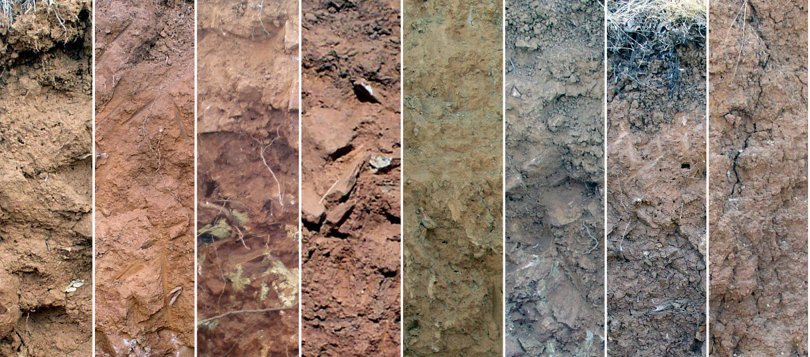
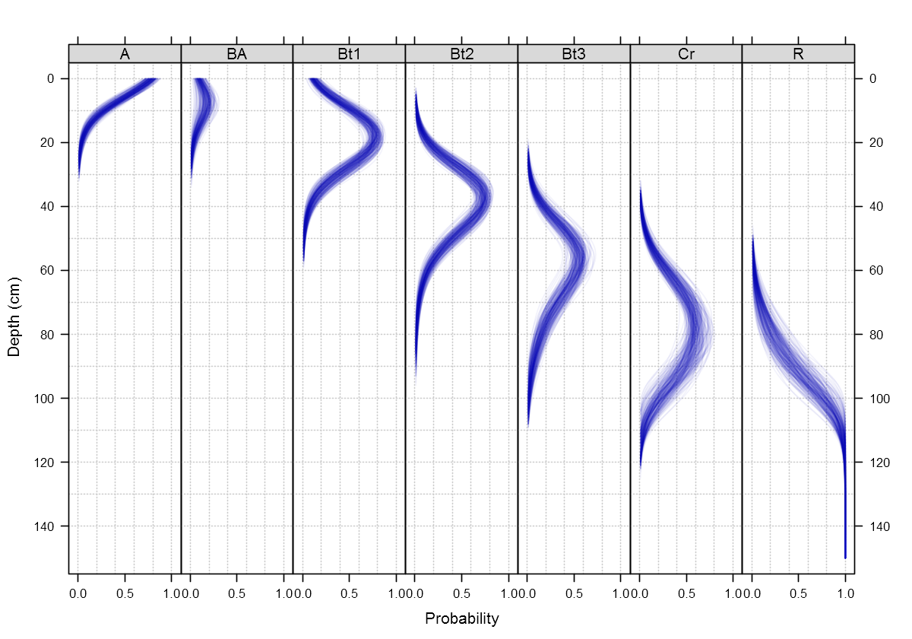

Aggregate representation of genetic soil horizons via proportional-odds logistic regression
========================================================
transition: none
width: 1024
height: 800
css: custom.css

D.E. Beaudette, P. Rouder, J.M. Skovlin

        
This document is based on `aqp` version 1.8-7 and `soilDB` version 1.5-5`.

Describing soil morphology in aggregate is hard
========================================================

- hz depths / designations: overlap, consistency, frequency
- style and convention: variation over time and by describer
- transition and infrequent horizons: BA, AB, BCt, etc.
- lumpers vs. spliters: A-Bt1-Bt2-R vs. A1-A2-AB-Bt1-Bt2-Bt3-Cr-R

can we do better than selecting a "representative pedon" from a collection?

Aggregation over generalized horizon labels
========================================================

1. determine the core concept: e.g. **A-Bt1-Bt2-Bt3-Cr-R**
2. assess existing data, relevant management or scientific needs
3. assign generalized horizon labels (GHL)
4. aggregate over GHL, in R / AQP syntax:
 - empirical: slice() &#8594;&nbsp; slab() &#8594;&nbsp; probability depth-functions
 - model-based:  slice() &#8594;&nbsp; orm() &#8594;&nbsp; probability model
5. determine most-likely horizonation

generalized horizon labels are expert-guided, "micro-correlation" decisions

Quick detour: definitions
========================================================
class: smaller

## proportional-odds (PO) logistic regression
$$P[Y \geq j | X] = \frac{1}{1 + exp[-(\alpha_{j} + X \beta]} $$
Extension of logistic regression model; predictions constrained by horizon designation and order. RCS basis functions accommodate non-linearity.

## Shannon Entropy (H index)
$$ H = -\sum_{i=1}^{n}{p_{i} * ln(p_{i})}  $$
$H$ is an index of uncertainty associated with predicted probabilities, $\mathbf{p}$, of encountering horizons $i$ through $n$ at some depth. Larger values suggest **more** confusion.

## Brier scores
$$ B = \frac{1}{n} \sum_{i=1}^{n}{ ( p_{i} - y_{i} )^{2}  }  $$
$B$ is an index of agreement between predicted probabilities, $\mathbf{p}$, and horizons, $\mathbf{y}$, over depth-slices $i$ through $n$ associated with a specific horizon. Larger values suggest **less** agreement between probabilities and observed horizon labels.

========================================================
class: smaller

Examples using 54 profiles correlated to Loafercreek soil series

- fine-loamy, mixed, super-active, thermic ultic haploxeralfs
- extent: foothills of the Sierra Nevada Mountains, MLRA 18
- uses: recreation, range, vineyard, low-density residential

colors represent generalized horizon labels (GHL)

Assignment of GHL: expert knowledge + data
========================================================

colors represent generalized horizon labels (GHL)

slice(): resample along 1-cm increments
========================================================

colors represent generalized horizon labels (GHL)

slab(): slice-wise probability calculation
========================================================

results are interpretable and directly tied to the original data, but over-fit

slice() and fit PO-logistic regression model
========================================================

proportional-odds logistic regression generalizes the process

GHL probability depth-functions / model
========================================================

Quantifying uncertainty
========================================================

Quantifying uncertainty
========================================================

Most likely horizonation
========================================================

Conclusions: aggregate soil morphology
========================================================
class: smaller
left: 40%

***

- fact: sampling by **genetic horizon** will continue to be important
- we can do better than picking a single, **representative profile**
- soil series **defined** by GHL rules, PO-LR model, and properties aggregated by GHL
- variability between descriptions **smoothed** as sample size increases-- *given thoughtful correlation*
- continuous **depth-functions** of genetic, or diagnostic horizons
- most-likely horizonation, based on depth-function crossings
- quantitative estimates of uncertainty: Brier scores, Shannon Entropy, etc.

Conclusions: further work
========================================================
class: smaller

- simulation of likely profile "sketches" from model
- minimum sample sizes, model diagnostics, etc.
- more realistic estimates of SE, e.g. correlation structure via GEE
- pedogenic interpretation of model coefficients
- management of GHL (mico-correlation decisions)
- ???

  

Thank You!

http://aqp.r-forge.r-project.org

